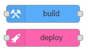
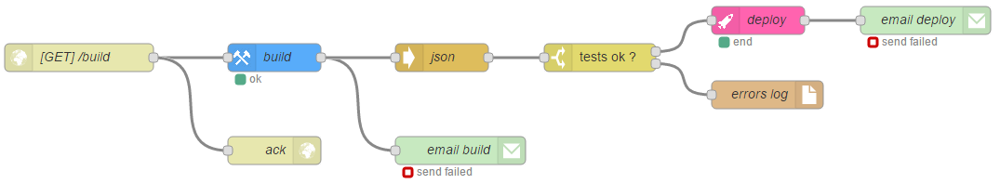

# node-red-contrib-continuous
nodes for continuous integration with node-red

## Installation
Use `npm install node-red-contrib-continuous` to install.

## Usage
This package provides nodes to create a continuous integration flow.

The build node is used to build a project into a local directory and execute tests.
The output contains the tests results in `msg.payload`.

The deploy node is used to to build a project into a local directory that is your deploy directory.

### nodes

### build in action

### continuous integration sapmple

